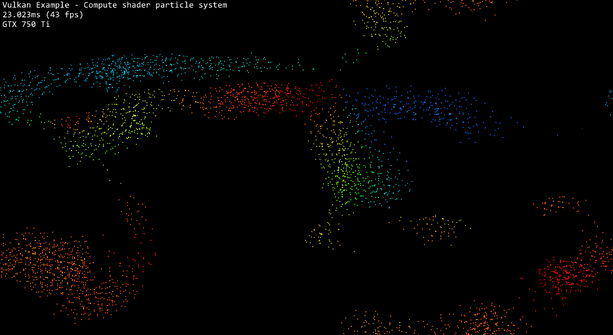

Vulkan Flocking: compute and shading in one pipeline!
======================

**University of Pennsylvania, CIS 565: GPU Programming and Architecture, Project 6**

* Michael Willett
* Tested on: Windows 10, I5-4690k @ 3.50GHz 16.00GB, GTX 750-TI 2GB (Personal Computer)

### Discussion

*Why do you think Vulkan expects explicit descriptors for things like generating pipelines and commands? HINT: this may relate to something in the comments about some components using pre-allocated GPU memory.*

Vulkan will actively try to minimize the amount of memory required for the command buffers. Since it will distribute pointers for command buffers from a preallocated memory pool, it needs to know the maximum
size a single command buffer could be, otherwise there is risk of overwriting data at the end memory referenced by the pointer.
 

*Describe a situation besides flip-flop buffers in which you may need multiple descriptor sets to fit one descriptor layout.*

In the context of a compute shader, the easiest example is a shader than can be generalized across multiple object types. Maybe the compute shader performs a single algorithmic update on each object such as
labeling each object into a bin. The developer could create multiple descriptor sets to separate one group of objects into 10 bins, and another descriptor set to group another collection of objects into 100 bins.

*What are some problems to keep in mind when using multiple Vulkan queues?*

* take into consideration that different queues may be backed by different hardware
* take into consideration that the same buffer may be used across multiple queues

Read/write conflicts of memory is clearly one of the most important. Within a single queue, memory barriers and fences can help ensure that data has fully been processed and updated by a shader before another
bit of code is run. However, between multiple queues, there are no structures available to provide the same guarantees. Synchronization is very important if the two queues will ever need to share data.

Additionally, if two queues are located on different hardware (for example, identical GPUs in the same machine), then they could make calls to the same memory addresses, however, the required data may only exist
on one GPU. Keeping track of where the data is again another chore for the developer to implement.

*What is one advantage of using compute commands that can share data with a rendering pipeline?*

The biggest advantage is there is not additional memory manipulation or management. If the rendering pipeline can read the state of various objects without needing additional pixel buffers to prevent read/write
conflicts while the compute shader is running.

### Credits

* [Vulkan examples and demos](https://github.com/SaschaWillems/Vulkan) by [@SaschaWillems](https://github.com/SaschaWillems)
